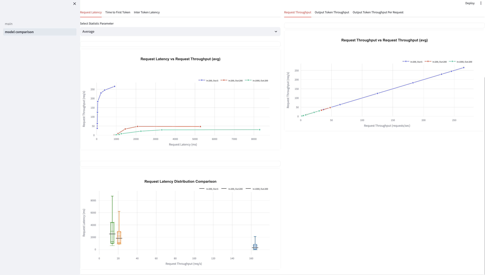
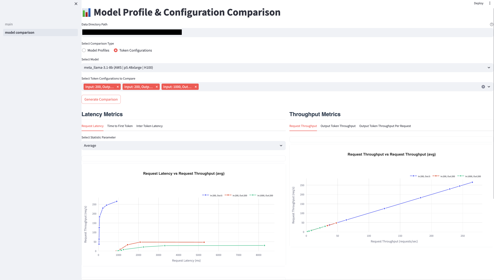
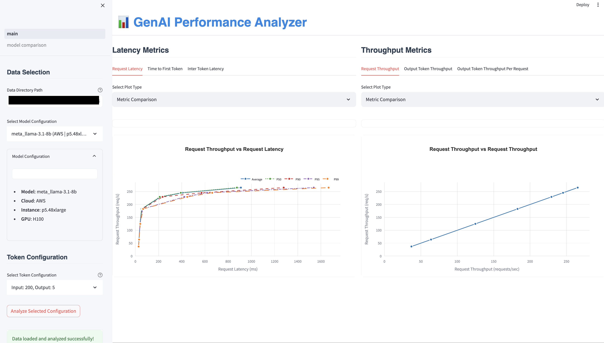

# GenAI Performance Analyzer

A streamlined tool for analyzing and visualizing performance metrics of Large Language Models (LLMs) across different configurations and runtime environments. Compatible with performance data generated by [NVIDIA's GenAI-Perf](https://github.com/triton-inference-server/perf_analyzer/tree/main/genai-perf) tool.

## Features

- **Interactive Visualization**: Dynamic plots with:
  - Latency distributions shown as box plots with throughput on x-axis
  - Performance metrics plotted against request throughput
  - Statistical indicators (mean, quartiles, P90, P99)
- **Configuration Comparison**: Compare different model configurations side by side with:
  - Overlaid box plots for latency distributions
  - Trend lines showing metric variations with throughput
  - Color-coded model configurations for easy differentiation
- **Metric Analysis**: Analyze various performance metrics including:
  - Request Latency
  - Time to First Token
  - Inter-token Latency
  - Request Throughput
  - Output Token Throughput
  - Output Token Throughput per Request

## Architecture

The application follows a modular architecture with clear separation of concerns. View the detailed [Architecture Documentation](docs/architecture.md) for:
- System Components Overview
- Data Flow Diagram
- Component Descriptions
- Technology Stack Details

## Interface Preview

<details>
<summary>Click to view interface screenshots</summary>

### Latency Distribution View

*Analyze latency distributions across different token configurations with interactive box plots and statistical insights*

### Model Comparison View

*Compare performance metrics between different model configurations and concurrency levels*

### Overall Interface

*Complete interface with sidebar controls and metric visualization panels*

</details>

## Installation

1. Clone the repository:
```bash
git clone https://github.com/yourusername/genai-perf-analyzer.git
cd genai-perf-analyzer
```

2. Create and activate a virtual environment:
```bash
python -m venv venv
source venv/bin/activate  # On Windows: venv\Scripts\activate
```

3. Install dependencies:
```bash
pip install -r requirements.txt
```

## Usage

1. Place your performance data in the `data/` directory following the expected format:
```
data/
├── meta_llama-3.1-8b_aws_p5.48xlarge_h100/              # Model with cloud provider and instance
│   ├── meta_llama-3.1-8b-instruct-openai-chat-concurrency1/
│   │   ├── 200_200_genai_perf.json    # Input 200, Output 200 tokens
│   │   ├── 200_5_genai_perf.json      # Input 200, Output 5 tokens
│   │   └── 1000_200_genai_perf.json   # Input 1000, Output 200 tokens
│   ├── meta_llama-3.1-8b-instruct-openai-chat-concurrency2/
│   │   ├── 200_200_genai_perf.json
│   │   └── ...
│   └── meta_llama-3.1-8b-instruct-openai-chat-concurrency5/
│       └── ...
└── meta_llama-3.1-8b_aws_g5.12xlarge_a10/              # Same model, different hardware
    └── meta_llama-3.1-8b-instruct-openai-chat-concurrency1/
        └── ...

```

Directory naming convention:
- Top level: `{model_name}_{cloud_provider}_{instance_type}_{gpu_type}`
- Test runs: `{model_name}-{api_type}-concurrency{N}`
- Results: `{input_tokens}_{output_tokens}_genai_perf.json`

2. Run the Streamlit application:
```bash
streamlit run app/main.py
```

3. Access the web interface at `http://localhost:8501`

## Data Format

The analyzer expects performance data in JSON format compatible with NVIDIA's GenAI-Perf output structure:

```json
{
  "request_latency": {
    "unit": "ms",
    "avg": 100.0,
    "p50": 95.0,
    "p90": 150.0,
    "p95": 180.0,
    "p99": 200.0,
    "min": 50.0,
    "max": 250.0,
    "std": 30.0
  },
  // ... other metrics
}
```

For information about generating performance data, refer to the [GenAI-Perf documentation](https://github.com/triton-inference-server/perf_analyzer/tree/main/genai-perf).

## Contributing

1. Fork the repository
2. Create your feature branch (`git checkout -b feature/amazing-feature`)
3. Commit your changes (`git commit -m 'Add some amazing feature'`)
4. Push to the branch (`git push origin feature/amazing-feature`)
5. Open a Pull Request

## License

This project is licensed under the MIT License - see the [LICENSE](LICENSE) file for details.

## Acknowledgments

- Built with [Streamlit](https://streamlit.io/)
- Visualization powered by [Plotly](https://plotly.com/)
- Data analysis using [NumPy](https://numpy.org/) and [Pandas](https://pandas.pydata.org/)