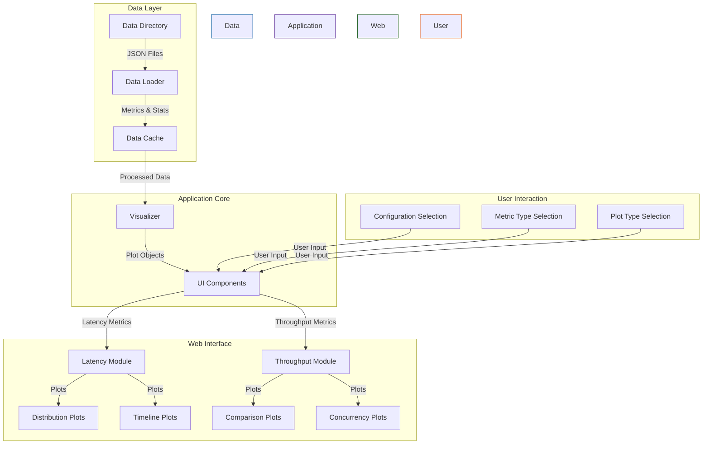

# Architecture Overview

## System Components

## Component Description

### Data Layer
- **Data Directory**: Contains performance metrics in JSON format
- **Data Loader**: Processes JSON files and extracts metrics
- **Data Cache**: Stores processed metrics for quick access

### Application Core
- **Visualizer**: Creates interactive plots using Plotly
- **UI Components**: Streamlit components for web interface

### Web Interface
- **Latency Module**: Handles latency-related visualizations
- **Throughput Module**: Handles throughput-related visualizations
- **Plot Types**:
  - Distribution Plots: Box plots for metric distributions
  - Timeline Plots: Time series visualization
  - Comparison Plots: Bar charts for metric comparisons
  - Concurrency Plots: Line plots for concurrency analysis

### User Interaction
- **Configuration Selection**: Model and token config selection
- **Metric Type Selection**: Choose metrics to analyze
- **Plot Type Selection**: Select visualization type

## Data Flow

1. User selects configurations and metrics through the web interface
2. Data Loader reads and processes JSON files from the data directory
3. Processed data is cached for performance
4. Visualizer creates appropriate plots based on user selection
5. UI components render the plots and handle user interaction

## Technology Stack

- **Frontend**: Streamlit
- **Visualization**: Plotly
- **Data Processing**: NumPy, Pandas
- **File Handling**: Python standard library 