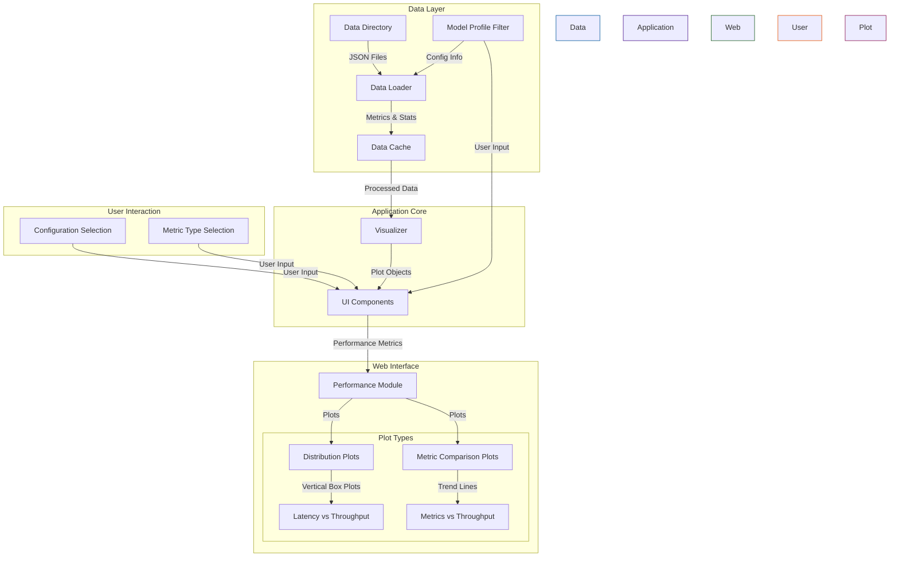

# Architecture Overview

## System Components

## Component Description

### Data Layer
- **Data Directory**: Contains performance metrics in JSON format
- **Data Loader**: Processes JSON files and extracts metrics
- **Data Cache**: Stores processed metrics for quick access
- **Model Profiles**: Extracts and manages model configuration information:
  - Engine type (TensorRT-LLM, vLLM)
  - Hardware specs (GPU type, precision)
  - Parallelization strategy (tensor/pipeline parallelism)
  - Optimization target (throughput/latency)

### Application Core
- **Visualizer**: Creates interactive plots using Plotly, with:
  - Consistent throughput-based x-axis
  - Unique color coding per model profile
  - Abbreviated profile labels for readability
- **UI Components**: Streamlit components for web interface

### Web Interface
- **Performance Module**: Unified handling of performance metric visualizations
- **Plot Types**:
  - Distribution Plots: Vertical box plots showing latency distributions against throughput
  - Metric Comparison Plots: Trend lines and statistical indicators plotted against throughput
  - Plot Features:
    - Consistent x-axis (throughput) across all plots
    - Statistical indicators (mean, quartiles, P90, P99)
    - Color-coded configurations with profile-based legends
    - Hover information showing full model profile details

### User Interaction
- **Configuration Selection**: Model and token config selection
- **Metric Type Selection**: Choose metrics to analyze
- **Model Profile Filter**: Filter visualizations by:
  - Engine type
  - GPU type
  - Precision
  - Parallelization strategy

## Data Flow

1. User selects configurations, metrics, and profile filters through the web interface
2. Data Loader reads JSON files and extracts model profile information from directory names
3. Processed data and profile information are cached for performance
4. Visualizer creates plots with:
   - Request throughput consistently on x-axis
   - Selected metrics on y-axis
   - Statistical indicators and distributions as appropriate
   - Unique identifiers and colors per model profile
   - Abbreviated labels with full details in tooltips
5. UI components render the plots and handle user interaction

## Technology Stack

- **Frontend**: Streamlit
- **Visualization**: Plotly
- **Data Processing**: NumPy, Pandas
- **File Handling**: Python standard library 